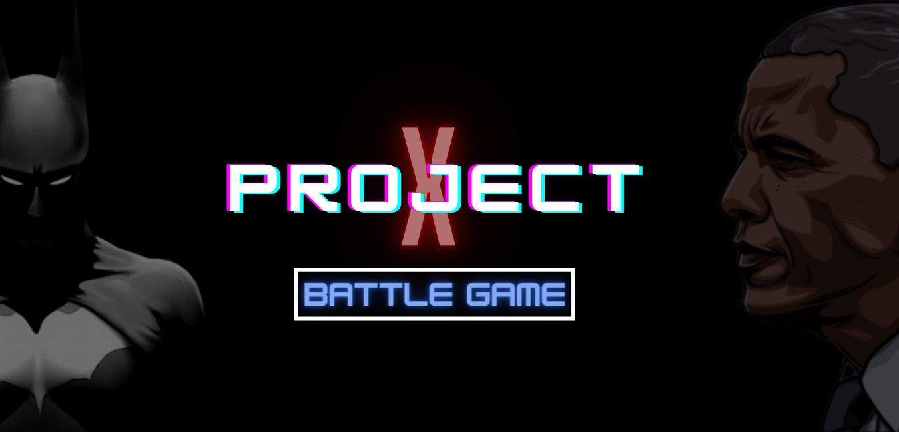

# Project X

## Deployment

[Deployment]()

## Technologies Used 

* Javascript
* React
* HTML/CSS/Bootstrap
* NPM
* SQL/Sequelize

## Description

This app was created to make a fun, exciting battle game so users can pass time. A user begins by signing up with an email, username, and password. They are redirected ot a screen including a leaderboard and user information. At the bottom there is a button to guide the user to begin the game. Once the game begins the user is prompted to choose their champion! The CPU is chosen at random and the battle begins. Once either the user or the CPU reaches health of 0, then the game is over.

This game was inspired by Rock Paper Scissors, but made with 5 choice options instead of 3. 

## Complications

Some compllications faced in this application was saving user data once logged in.

# Contributors

Jennifer Henry

[Github](https://github.com/jenryhennifer) ||
[LinkedIn](https://www.linkedin.com/in/jennifer-henry-4a540a149/edit/add-link/) || 
[Portfolio](https://morning-ridge-20215.herokuapp.com/)

Ry Hull

[Github](https://github.com/ryandelonhull) || 
[LinkedIn](https://linkedin.com/in/ryan-hull-94003144) ||
[Portfolio](https://ryandelonhull.github.io/Repo-React-ion/)

Rachael Kelm-Southworth

[Github](https://github.com/RKSouth) ||
[LinkedIn](https://www.linkedin.com/in/rachael-kelm-southworth-87a3831b3) ||
[Portfolio](https://rksouth.github.io/React-Portfolio/)

Earnest Wesson

[Github](https://github.com/HEEM86) ||
[LinkedIn](https://www.linkedin.com/in/ernest-wesson-b4183b5a/) ||
[Portfolio](https://github.com/HEEM86/ReactPortfolio)

# License

MIT License

Copyright (c) 2020 Jennifer Henry

Permission is hereby granted, free of charge, to any person obtaining a copy of this software and associated documentation files (the "Software"), to deal in the Software without restriction, including without limitation the rights to use, copy, modify, merge, publish, distribute, sublicense, and/or sell copies of the Software, and to permit persons to whom the Software is furnished to do so, subject to the following conditions:

The above copyright notice and this permission notice shall be included in all copies or substantial portions of the Software.

THE SOFTWARE IS PROVIDED "AS IS", WITHOUT WARRANTY OF ANY KIND, EXPRESS OR IMPLIED, INCLUDING BUT NOT LIMITED TO THE WARRANTIES OF MERCHANTABILITY, FITNESS FOR A PARTICULAR PURPOSE AND NONINFRINGEMENT. IN NO EVENT SHALL THE AUTHORS OR COPYRIGHT HOLDERS BE LIABLE FOR ANY CLAIM, DAMAGES OR OTHER LIABILITY, WHETHER IN AN ACTION OF CONTRACT, TORT OR OTHERWISE, ARISING FROM, OUT OF OR IN CONNECTION WITH THE SOFTWARE OR THE USE OR OTHER DEALINGS IN THE SOFTWARE.